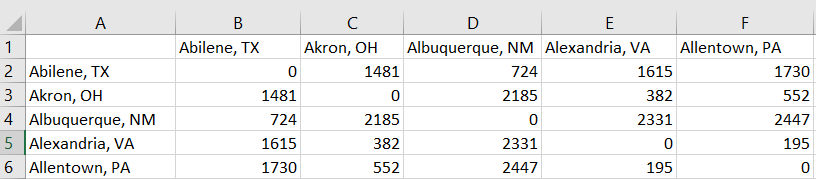

# Excel File I/O

The attached Distances.xlsx file contains a spreadsheet with the pairwise distances in miles of the top 100 US cities by population. A preview of the spreadsheet is shown below. The first row and first column contain the city names using the following format: city name comma space capitalized state abbreviation, e.g., Nashville, TN. Note that the very first cell of the spresheet, A1, is blank. 

Write a function called get_distance that accepts two character vector inputs representing the names of two cities. The function returns the distance between them as an output argument called distance. For example, the call get_distance('Seattle, WA','Miami, FL') should return 3723. If one or both of the specified cities are not in the file, the function returns -1.

Your function should load the data only once. File I/O is a time consuming operation. Loading the data multiple times is will likely cause a time-out error when submitting your function.

Preview of the first five cities of Distances.xlsx 